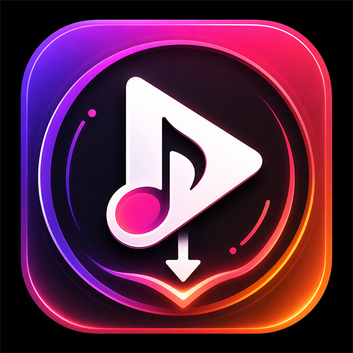
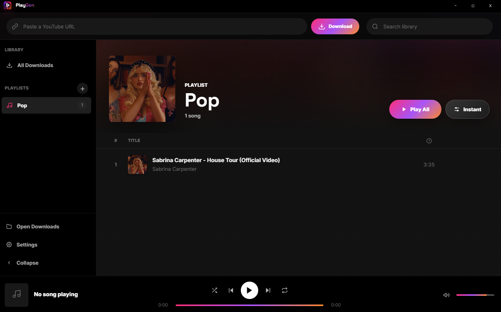

<p align="center">
  
</p>

<h1 align="center">PlayGen Player</h1>

<p align="center">
  <strong>YouTube music downloader & playlist manager</strong><br />
  <sub>Download · Organize · Play — all in one app</sub>
</p>

<p align="center">
  <a href="https://github.com/belinda-hagen/PlayGen-Player/releases/latest"></a>
  <a href="https://github.com/belinda-hagen/PlayGen-Player/releases"></a>
  
  
  <a href="LICENSE"></a>
  <a href="https://github.com/belinda-hagen/PlayGen-Player/stargazers"></a>
</p>

<p align="center">
  
</p>

---

<h2>Features</h2>

| Feature | Description |
|---|---|
| **Download from YouTube** | Paste a video link and get a high-quality MP3 |
| **Download whole playlists** | Paste a YouTube playlist link to grab every track at once |
| **Playlist system** | Create, rename, reorder (drag-and-drop) & delete playlists |
| **Next-song delay** | Set a per-playlist gap between tracks (Instant → 30 seconds) |
| **Export to folder** | Copy a whole playlist's MP3s to any folder on your PC |
| **Full music player** | Play/pause, skip, shuffle, repeat, seek & volume |
| **Adaptive cover art** | The now-playing banner tints itself to match the album art |
| **Audio visualizer** | Real-time equalizer bars on the album thumbnail |
| **Mini player** | Compact always-on-top player when minimized (toggle in settings) |
| **Listen Together** | Host a party on your network and let friends listen along, in sync |
| **Search** | Instantly filter songs across your library |

> **Tip:** Right-click a playlist to **rename** it, set its **next-song delay**, or **export** all its tracks to a folder. Inside a playlist a song is only *removed* from that playlist — permanent deletion lives in the **Downloads** view.

## Listen Together

Play the same music, at the same moment, with people on your network.

**To host:** open **Listen Together** in the sidebar, enter your name, and hit
**Start a party**. PlayGen shows an address like `192.168.1.42:8420` to share.

**To join:** open **Listen Together** — parties on your network show up on their
own, so just hit **Join**. If nothing appears (some networks block broadcast
traffic), type the host's address in by hand.

Guests **stream the audio from the host**, so they hear the host's tracks whether
or not they have them. Everyone's playhead stays locked to the host's, and each
listener keeps their own volume.

| | |
|---|---|
| **Who controls playback** | The host, unless they switch on *Let guests control playback* |
| **Join code** | Optional — turn it on to require a 4-digit code |
| **Removing someone** | Hosts can remove any listener from the party panel |
| **Reach** | Same network, or the same VPN. There's no relay server, so it won't traverse the open internet |
| **Firewall** | Windows may ask you to allow PlayGen the first time you host — say yes, or nobody can connect |

## Prerequisites

| Tool | Install |
|------|---------|
| **Node.js** 18+ | [nodejs.org](https://nodejs.org) |
| **yt-dlp** | `winget install yt-dlp` or [GitHub releases](https://github.com/yt-dlp/yt-dlp/releases) |
| **ffmpeg** | `winget install ffmpeg` or [ffmpeg.org](https://ffmpeg.org/download.html) |

## Quick Start

```bash
git clone https://github.com/belinda-hagen/PlayGen-Player.git
cd PlayGen-Player
npm install
npm start
```

## Keyboard Shortcuts

| Key | Action |
|-----|--------|
| `Space` | Play / Pause |
| `←` / `→` | Seek −5s / +5s |
| `Ctrl+←` / `Ctrl+→` | Previous / Next track |
| `↑` / `↓` | Volume up / down |
| `S` | Toggle shuffle |
| `R` | Cycle repeat |
| `Ctrl+F` | Focus search |
| `Ctrl+V` | Paste a copied YouTube link into the download bar |

## Disclaimer

This tool is intended for downloading content you have the right to download. Users are responsible for complying with applicable laws and YouTube's Terms of Service. The developers of PlayGen do not condone or encourage downloading copyrighted material without permission.

## 📄 License

[MIT](LICENSE)
